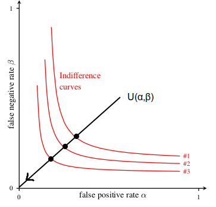
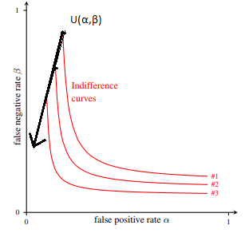

# CSE 5338 HW 1.

__Seung Ki Lee__

__35460312__

## Q1

**Identification**: This asks the question "Who are you?" Facebook identifies the user for NYT by the user's information such as ID and email address.

**Authentication**: This asks the question "Are you who you say you are?" Facebook Authenticates the user by requesting the login information.

**Authorization**: This asks the question "Do you have permission to do what you say you want to do?" NYT authorizes the user.

## Q2

**a.** FERPA form, that every student has to fill out every year is a classic example where confidentiality and availability clashes. It would be easier for both parents and students if you can just give out your academic record on demand, but that will increase the chance of unauthorized person getting hold of your sensitive personal information. Medical records are another example that possesses the same conflict.

**b.** Wikipedia is a good example where these two collide. For the availability of information Wikipedia relies on independent user submissions, but because of that very reason they cannot screen and guarantee that the information on the wiki has any integrity.

## Q3

**a.**

Curve \#3 is the most preferred. Both false positive and false negative are undesirable, and IC3 has the lowest value for both or them. The optimal point of utilities are all on IC3 as well. A general Utility function is:

$U(\alpha, \beta) = u \times \alpha + v \times \beta$

In this case, lower the value of $\alpha$ and $\beta$ the higher the utility. So the accurate version of the function is:

$U(\alpha, \beta) = u \times {1\over \alpha} + v \times {1\over \beta}$

$Assume: u \sim v$

$(\alpha_{3}, \beta_{3}) < (\alpha_{2}, \beta_{2}) < (\alpha_{1}, \beta_{1})$

$U(\alpha_{3}, \beta_{3}) > U(\alpha_{2}, \beta_{2}) > U(\alpha_{1}, \beta_{1})$

$(\alpha_{3}, \beta_{3}) \in IC3$

Thus IC3 is most preferred.

**b.**

Given assumption is:

$(h,l) \sim (l, h)$

$(l,l) \succ (h,h)$

My legend is for the multipliers:

$2 = u(high)$

$1 = u(med)$

$0 = u(low)$

Thus lower the value of $\alpha$ and $\beta$ gets, the greater the $U$ gets. However we are indifferent between utility gained from $\alpha$ and $\beta$. The utility function is therefore:

$U(\alpha, \beta) = u \times {1\over \alpha} + v \times {1\over \beta}$

$u = v = 1$

$\therefore U(\alpha, \beta) = {1\over \alpha} + {1\over \beta}$

since the utility depends equally on both values, the graph for Utility curve would be:

**c.**

In this case the utility gained from limiting false positive is far greater than limiting false negative. This means we can trade off the high false negatives for lower false positives. Given assumption will be:

$for \  (\alpha, \beta)$

$(l,h) \succ (h, l)$

$(l,l) \succ (h,h)$

My legend is for the multipliers:

$2 = u(high)$

$1 = u(med)$

$0 = u(low)$

Above Utility Function was:

$U(\alpha, \beta) = u \times {1\over \alpha} + v \times {1\over \beta}$

Because utility from lower $\alpha$ is the priority, we can assume that utility coming from $\beta$ is low, and negligible.

$u > v$

$u = 2$

$v = 0$

$U(\alpha, \beta) = 2 \times {1\over \alpha} + 0 \times {1\over \beta}$

$\therefore U(\alpha, \beta) = 2 \times {1\over \alpha}$

since the utility solely depends on value of false positive, the graph would be:

#### Scenario 1

Trials in legal system. If we are sending people to jail, it would be more desirable to minimize the false positive - thus pro dubio reo.

#### Scenario 2

## Q4

**a.**

$let \ E(not) \ = 0.01 \times \$5,000,000$

$let \ E(do) \ = \$25,000$

Since E(do) < E(not), it is more desirable to purchase the protection

**b.** 

$let \ E(not) \ = x \times \$5,000,000$

$let \ E(do) \ = \$25,000$

$x = {\$ 25,000 \over \$ 5,000,000} = {1 \over 200} = 0.5\%$

As long as the probability of DDoS attack is greater than 0.5%, the company will justify paying for the protection

## Q5

### 1 We are spending enough money

In 2016, United State government \$18,538,752 on cybersecurity [[1]](https://hewlett.org/qa-ryan-alexander-much-u-s-government-spending-cybersecurity/). Is this enough? The best way to see if you are spending enough money on something is to see if the job is being done. As president Obama has pointed out "So far, no one has managed to seriously damage or disrupt our critical infrastructure networks [[2]](https://www.forbes.com/sites/jodywestby/2012/07/27/urgent-businesess-must-act-to-stop-congress-on-cyber-legislation/#7718893e1286)." And this record continues despite many worries on U.S.'s cybersecurity. As one said, "no need to fix what ain't broken." We are doing enough for our protection.

### 2 We are not spending enough money

A quick math to determine if we are underspending the cybersecurity budget is to compare the risk to the cost.

$let \ E(damage)$ be dollar value of the market failure $\rightarrow$ failure of critical infrastructure

$let \ E(cost)$ be annual spending for protection of these critical infrastructure

$let \ P(damage)$ be probability of the market failure

$let \ x = {E(damage) \over E(cost)}$ then,

$H_0 = E(damage) \times  P(damage) \leq E(cost) \equiv x \geq P(damage)$

$H_a = E(damage) \times  P(damage) > E(cost) \equiv x < P(damage)$

Null Hypothesis assumes we are spending enough on the cybersecurity.

For simplicity of mathematics, let's choose Nuclear Power Plant as an example. It is safe to assume that with the failure in nuclear power plant will at least result in the loss of the cost to build them. This amounts to \$ 9,000,000,000 [[3]](https://www.ucsusa.org/nuclear-power/cost-nuclear-power#.W6GjQ15KiUk). There are 61 commercially operating nuclear power plants in the United States [[4]](https://www.eia.gov/tools/faqs/faq.php?id=207&t=3). 

$E(cost) = \$18,538,752$

$E(damage) = \$ 138,350,000,000$ [[5]](http://large.stanford.edu/courses/2013/ph240/bechstein1/)

Then, the threshold for the probability of damage in single power plant is:

$x = 0.000134 = 0.0134\%$

Since there are 61 power plants, this number becomes:

$x = 0.0000022 = 0.00022\%$

This is almost same number as the probability of 9/11 attack unfolding exactly as it did [[6]](http://911review.com/means/index.html). To assume that probability of breach in one of 61 nuclear power plants is lower than that of 9/11 is unreasonable. Moreover, this number is simply a calculation from nuclear power plants. We have many more infrastructures and their expected damage will only lower the threshold x. Therefore, it is reasonable to assume that we are not putting in enough funding for cybersecurity.

### 3 My Choice

I personally agree with the 2nd view. While for any other product or service "don't fix what ain't broken" may hold, security is a different animal. Security serves as an insurance. The purpose of insurance is to convert risk to cost and have it be managed. Just because nothing has happened until now, does not mean it won't happen tomorrow.

__SOURCE__

[[1]](https://hewlett.org/qa-ryan-alexander-much-u-s-government-spending-cybersecurity/)  US spending on cybersecurity 2016

[[2]](https://www.forbes.com/sites/jodywestby/2012/07/27/urgent-businesess-must-act-to-stop-congress-on-cyber-legislation/#7718893e1286)  President Obama's statement

[[3]](https://www.ucsusa.org/nuclear-power/cost-nuclear-power#.W6GjQ15KiUk)  Cost of building nuclear power plants

[[4]](https://www.eia.gov/tools/faqs/faq.php?id=207&t=3)  Nuclear power plant stats

[[5]](http://large.stanford.edu/courses/2013/ph240/bechstein1/)  Cost of Accident

[[6]](http://911review.com/means/index.html)  9/11 probability

## Q6

Roughly 6 hours +. Admittedly a major portion of it was for formatting and editing. Q5 took a lot of time for me because I had to do separate research.