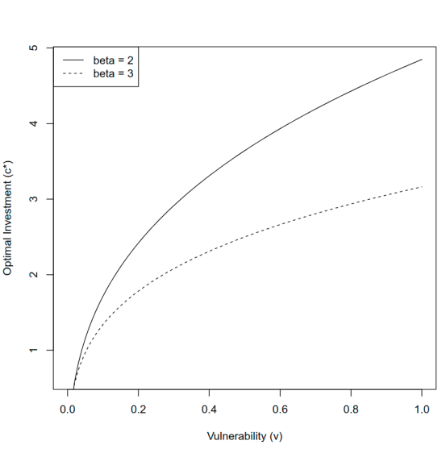
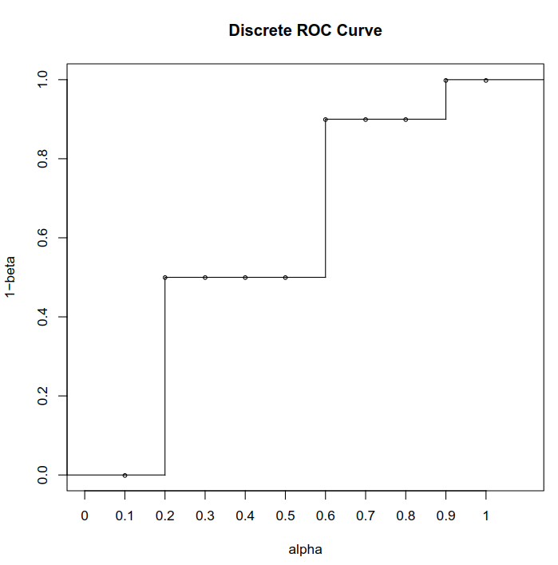
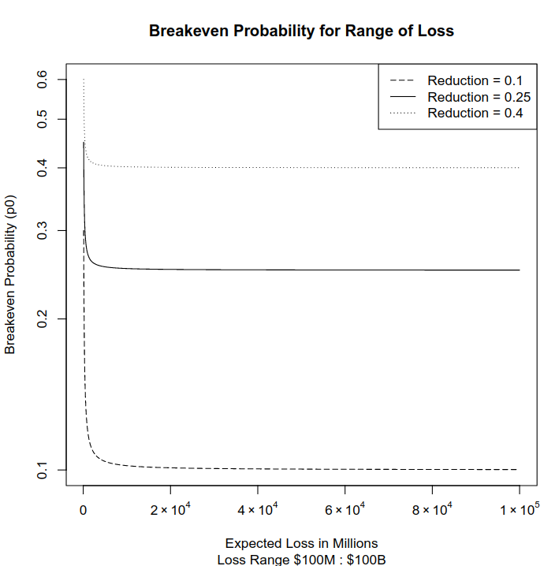
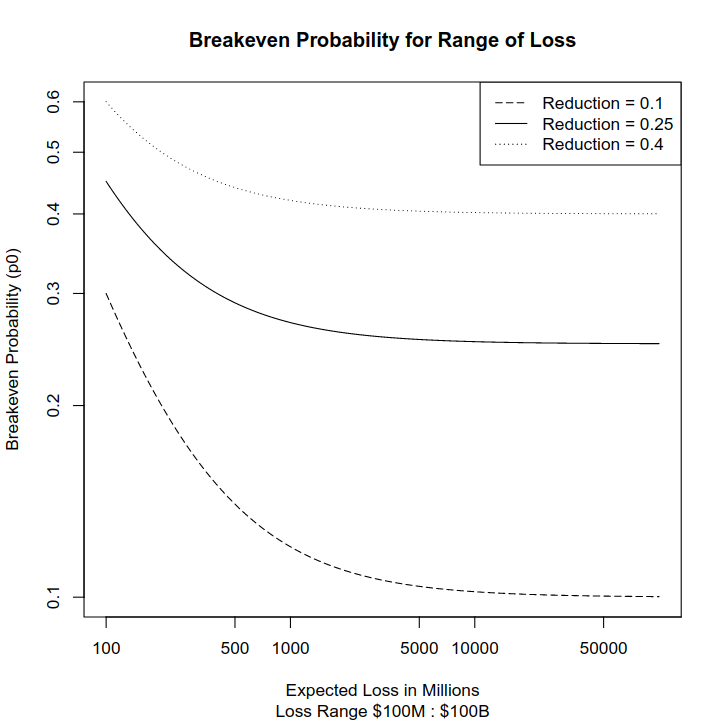

# CSE 5338 Homework 2

__Seung Ki Lee__
__35460312__


## Q1

$p_{0} = 0.5$

$l = \$20,000$

$c_{opt1} = c_{o} + c_{r} \times y =  \$500 + (\$1,000 \times year)$

$p_{opt1} = 0.4$

$c_{opt2} = c_{o} + c_{r} \times y = \$5,000 + (\$5,000 \times year)$

$p_{opt2} = 0.1$


### a. Initial Costs Only

$ROSI = {benefit - cost \over cost} = {ENBIS \over c}$

$ENBIS = (p_{0} \times l) - (p_{s} \times l) - c = (\Delta p \times l) - c$

Since we are considering only initial costs, $c = c_{o}$

$ENBIS_{opt1} = (0.5 \times \$20,000) - (0.4 \times \$20,000) - \$500 = \$2,000 - \$500 = \$1,500$

$ENBIS_{opt2} = (0.4 \times \$20,000) - \$5,000 = \$3,000$

$ROSI_{opt1} = {1,500 \over 500} = 3$

$ROSI_{opt2} = {3,000 \over 5,000} = 0.6$

$ROSI_{opt1} > ROSI_{opt2}$

$\therefore$ We prefer Option 1.


### b. NPV

Calculated the NPV based on the following R Code

```R
# NPV function
npv <- function(r, c0, ct, ALE0, ALEs, tmax=10) {
  a <- (ALE0-ALEs-ct)
  b <- (1+r)^(1:tmax)
  -c0+sum(a/b)
}

# calculated NPV for both options. 6% discount rate, initial cost, recurring cost, ALEo, ALEs, and 8 years for t max
npv_opt1 = npv(0.06, 500, 1000, 10000, 8000, 8)
npv_opt2 = npv(0.06, 5000, 5000, 10000, 2000, 8)

# output
>> opt1 = "5709.79381096955"
>> opt2 = "13629.3814329087"
```

Thus, here we prefer Option 2.


### c. Which Option would you recommend?

While the recommendation can vary depending on the situation of the firm, I would recommend choosing option 2. Simple answer would be, the ROSI calculation only included the initial cost, and therefore may be an inaccurate model of a firm's situation over a long run. For instance, over 8 year period, here is the balance sheet for both options

- Option 1

Total Cost = \$500 + (7 x \$1,000) = \$7,500

Total Benefit = (8 x \$2,000) = \$16,000

Net = \$16,000 - \$7,500 = \$8,500

- Option 2

Total Cost = \$5,000 + (7 x \$5,000) = \$40,000

Total Benefit = (8 x \$8,000) =\$64,000

Net = \$64,000 - \$40,000 = \$24,000


So for a general use case, I will recommend option 2. Especially if the firm is considering this option for a long term solution.


### d. Risks Accepted vs Mitigated

$Risk_{total} = Risk_{accepted} + Risk_{mitigated}$

$Risk_{total} = (p_{0} \times l)= (0.5 \times \$20,000) = \$10,000$

$Risk_{mitigated} = (\Delta p \times l)$

$Risk_{m1} = (0.5-0.4) \times \$20,000 = \$2,000$

$Risk_{m2} = (0.5-0.1) \times \$20,000 = \$8,000$


Option 2 mitigates more risk, therefore Option 1 accepts more risk. The risk accepted by Option 1 is given by:

$Risk_{total} - Risk_{m1} = Risk_{a1} = \$8,000$


## Q2

v represents the exogenous vulnerability $\in [0,1]$. This means regardless of what c or $\alpha$ value is, the probability of breach is 100%. Mathematically we can see that for all possible values for c and $\alpha$  $1^n = 1$, and therefore no matter what security level you have you will always get breached. 

This is not impossible, but unrealistic in my opinion because we are observing a snapshot of a time period. If v = 1, it means c and $\alpha$ values are irrelevant in deriving the probability of the breach. In this case, the best option is to spend nothing on the security as the attack is indefensible. If the assumption is relaxed to  $$\lim_{t \to \infty} v(t) = 1$$, then I can agree that there are points in time where some attacks can not be defended.


## Q3

### a. Optimal C*

I prefer the option that offers higher beta value. From simple algebra I can see that ceteris paribus c* will increase as beta value increases. Which means for the same value of v, higher beta value will require less investment.


### b.

Here is the code for the plot

```R
# fixed lambda value for comparison
C.opt <- function(beta, v, lambda=100) {
  (beta * v * lambda)^(1/(beta+1)) - 1
}

# Create sequence of v values
vseq <- seq(0, 1, by = 0.01)

# C.opt Wrapper for getting C.opt for each value of v
get_copt <- function(b) {
    C.opt(beta=b, v=vseq)
}

# Plotting
plot(
    y = get_copt(2),
    x = vseq,
    type = 'l',
        ylim = c(
        get_min(get_copt(2), get_copt(3))
        get_max(get_copt(2), get_copt(3))
        ),
    ylab = "Optimal Investment (c*)",
    xlab = "Vulnerability (v)"
)

lines(
    y = get_copt(3),
    x = vseq,
    type = 'l',
    lty = 2
)

legend(
    "topleft",
    c("beta = 2", "beta = 3"),
    lty = 1:2
)
```

The plot looks like this




**NOTE:** I used $\lambda = 100$ in plotting as an arbitrary fixed value, but out of serendipity realized that if I change $\lambda$ value the plot can look very different. For the subsequence questions, I will maintain this assumption for $\lambda$. Please let me know if my methodology is flawed.


### c. 

I can as long as Cost of prevention $\leq$ Cost of breach. Mathematically,

$p_{0} \times \lambda \geq c$

$\lambda \geq \frac{c}{p_{0}}$

in this case, v = 1 and by definition of $p_{0}$, c = 0

$p_{0} = S^I (c,v) = { v \over (c+1)^\beta} $

in which case, regardless of $\beta$ value $p_{0} = 1$

Algebraically I can derive $\lambda \geq c$, which means you can spend up to your cost of breach. Rationally, at v =1, where you are 100% likely to get attacked, you can spend up to 100% of your loss for the security and get more if not the same utility as taking the loss.


### d.

$p = S^{I} (c,v) = { v \over (c+1)^{\beta} }$

$c^* = (\beta v \lambda)^{1 \over \beta+1} - 1$

$\beta_{1} = 2$

$\beta_{2} = 3$

Assuming constant $\lambda$ = 100 , $v = 1$

$c^*_{\beta_{1}} = 200^{1 \over 3} - 1 = 4.848$

$c^*_{\beta_{2}} = 300^{ 1 \over 4} -1 = 3.162$

when v = 1, the probability of breach is given by $1 \over (c+1)^\beta$.  So the following gives the probability of breach given optimal investment

$p_{\beta_{1}} = {1 \over (c_{\beta_{1} + 1})^\beta_{1}} = {1 \over ({4.848 + 1})^2} = 0.029$

$p_{\beta_{2}} = {1 \over (c_{\beta_{2} + 1})^\beta_{2}} = {1 \over ({3.162 + 1})^3} = 0.014$

$p_{0} = { S^{I} (0, 1) }$ = 1

$ENBIS = (\Delta p \times \lambda) - C$


$\therefore$

$ENBIS_{\beta_{1}} = [(1-0.029) \times 100] - 4.848 = 92.252$

$ENBIS_{\beta_{2}} = [(1-0.014) \times 100] - 3.162 = 95.438$


### e.

It makes sense for you to decrease the spending on security if you are at your target vulnerability level. For all values of v, option 2 requires cheaper cost = lower optimal c level than option 1. For instance, if you were already at c* = 3 with option 1 you are combating vulnerability of roughly 0.3. You can see in the graph that in option 2, c* = 3 will be almost sufficient to combat vulnerability of 1.0. Thus you can lower the spending and optimize the operation.


## Q4

### a. Mitigation

### b. Mitigation

### c. Avoidance

### d. Acceptance

### e. Transfer


## Q5

### a. 

```R
ia <- seq(0, 1, 0.1)
ib <- c(0.0, 0.0, 0.5, 0.5, 0.5, 0.5, 0.9, 0.9, 0.9, 0.9, 1)

rocb <- stepfun(1:10, ib, f= 0)
plot(rocb, ylim=c(0, 1.0), ylab="1-beta", xlab="alpha", main="Discrete ROC Curve")
```



### b.

```R
# Given -< cost of false neg, cost of false pos, prob of malware >-
C.beta <- 300
C.alpha <- 100
P.malware <- 0.2

# Config A
A.alpha <- 0.2
A.beta <- 0.5

# Config B
B.alpha <- 0.6
B.beta <- 0.1

# Compute expected Cost for both config

C.Config <- function(alpha, beta, p = P.malware, cost_a = C.alpha, cost_b = C.beta) {
    ((p * beta * cost_b)) + ((1-p) * alpha * cost_a)
}

C.Conf.A <- C.Config(A.alpha, A.beta)
C.Conf.B <- C.Config(B.alpha, B.beta)


paste("Config A: $", C.Conf.A)
paste("Config B: $", C.Conf.B)

if (C.Conf.A > C.Conf.B) {
    paste("Config B is Cheaper with $", C.Conf.B, "< $", C.Conf.A)
} else if (C.Conf.A == C.Conf.B) {
    paste("Choose Whatever. They are the same for $", C.Conf.A)
} else {
    paste("Config A is Cheaper with $", C.Conf.A, "< $", C.Conf.B)
}

# Output
>> "Config A: $ 46"
>> "Config B: $ 54"
>> "Config A is Cheaper with $ 46 < $ 54"
```

Config A is prefered.


### c.

```R
# Given -< cost of false neg, cost of false pos, prob of malware >-
# Same Arbitrary Cost for beta and alpha
C.beta <- 100
C.alpha <- 100
# vectorize the probability
pseq = seq(0, 1, 0.01)
P.malware <- pseq

# Config A
A.alpha <- 0.2
A.beta <- 0.5

# Config B
B.alpha <- 0.6
B.beta <- 0.1

# Compute expected Cost for both config
C.Config <- function(alpha, beta, p = P.malware, cost_a = C.alpha, cost_b = C.beta) {
    ((p * beta * cost_b)) + ((1-p) * alpha * cost_a)
}

C.Conf.A <- C.Config(A.alpha, A.beta)
C.Conf.B <- C.Config(B.alpha, B.beta)

# Check for the range of values that A is cheaper or equal to B.
ifelse (C.Conf.A <= C.Conf.B, paste(C.Conf.A), paste("Config B Prefered from here"))

# Output
[1] "20"                          "20.3"                       
[3] "20.6"                        "20.9"  
...
[49] "34.4"                        "34.7"                       
[51] "35"                          "Config B Prefered from here"
[53] "Config B Prefered from here" "Config B Prefered from here"
...

# From P.malware = 0.51, I got Config B == Config A
```

So A is preferred to B from 0 to 0.5, indifferent at 0.51, and from then B is preferred.

## Q6

### a.

$c_{911}$ = \$20,000,000,000

$c_{door}$ = \$40,000,000

$p_{door} = p_{0}-0.25$

if $p_{door} \times c_{911} \leq c_{door}$, it is reasonable to put the door in. Algebraically :

$p_{door} = { c_{door} \over { c_{911} } } = { 1 \over {500} } = 0.002​$

$p_{0} = 0.002 + 0.25 = 0.252$

Thus the break even probability of attack is 0.252.


### b.

```R
# Sequence of Loss Value in millions, increase by 1 milion from 100M to 100B
lseq = seq(100, 100000, 1)

# probability of breakeven point as a function of loss value = C.911, cost C.door = 40milion, and risk reduction reduc
P.breakeven <- function(C.911, C.door = 40, reduc) {
  (C.door/C.911) + reduc
}

# Map Probability
get_pbe <- function(risk.reduction) {
  P.breakeven(C.911 = lseq, C.door=40, reduc = risk.reduction)
}

plot(
    y = get_pbe(0.25),
    x = lseq,
    type = 'l',
    # Log scale y for legibility
    log = "y",
    lty = 2,
    # To Replace X Axis Label
    xaxt="n",
    ylab = "Breakeven Probability (p0)",
    xlab = "Expected Loss in Hundred Millions",
    main = "Breakeven Probability for Range of Loss",
    sub = "Loss Range $100M : $100B",
    ylim=c(0.1, 0.6)
)

# Format X Axis for Legibility
axis(
    1, 
    at=c(0e+00, 2e+04, 4e+04, 6e+04, 8e+04, 1e+05), 
    labels=expression(0, 2%*%10^4, 4%*%10^4, 6%*%10^4, 8%*%10^4, 1%*%10^5) 
)

lines(
    y = get_pbe(0.4),
    x = lseq,
    type = 'l',
    log = "y",
    lty = 4
)

lines(
    y = get_pbe(0.1),
    x = lseq,
    type = 'l',
    log = "y",
    lty = 1
)

legend(
    "topright",
    c("Reduction = 0.1", "Reduction = 0.25", "Reduction = 0.4"),
    lty = c(2,4,1)
)
```

#### Log Scale Y Plot



#### Log Scale XY Plot



## Q7

About 12 hours. This was a long homework.